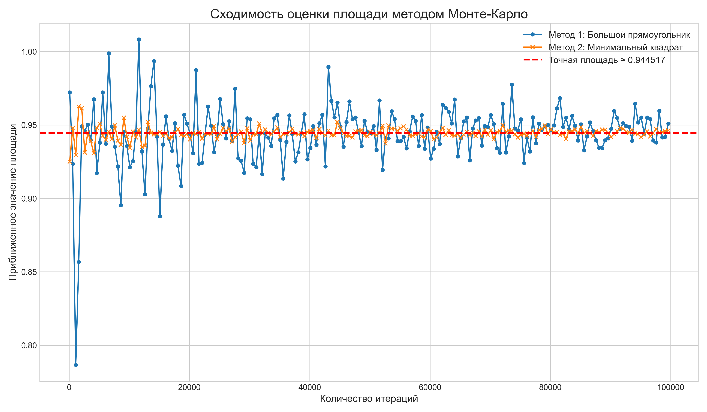
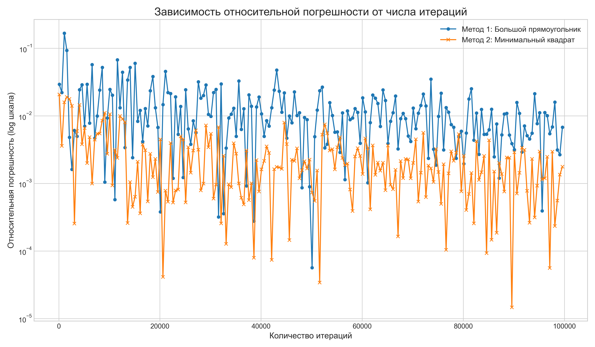
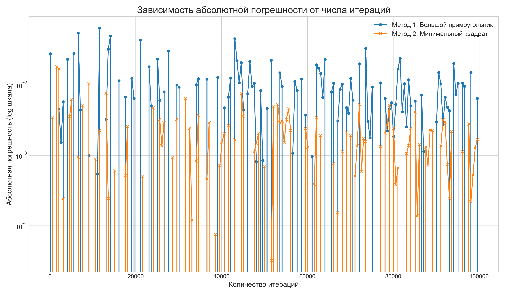

Номер посылки на CodeForces: 347606295

## Анализ эффективности метода Монте-Карло для вычисления площади пересечения кругов

### 1. Введение

В рамках задания проводится анализ эффективности метода Монте-Карло при вычислении площади пересечения трех окружностей. Рассматриваются два подхода к генерации случайных точек: в широкой и узкой прямоугольной области.

### 2. Методология эксперимента

**Параметры исследования:**
* **Методы генерации:**
  * Метод 1: генерация в широкой прямоугольной области
  * Метод 2: генерация в узкой прямоугольной области
* **Диапазон количества точек:** от 100 до 100000 с шагом 500
* **Точное значение площади:** $S = 0.25\pi + 1.25\arcsin(0.8) - 1 ≈ 0.9445$

**Инструменты**
- **Бенчмаркинг**: 'A1i_benchmark.cpp'.
- **Анализ и визуализация**: 'A1_analysis.ipynb'.

### 3. Результаты исследования

#### 3.1. Анализ сходимости методов

**Основные наблюдения:**
* Оба метода сходятся к истинному значению
* Метод 2 показывает более стабильную сходимость
* При малых N наблюдается значительный разброс значений
* При N > 50000 результаты стабилизируются

#### 3.2. Анализ относительной погрешности

**Ключевые выводы:**
* Метод 2 имеет меньшую относительную погрешность
* При N = 100000 погрешность менее 0.5%
* Логарифмическая шкала подчеркивает преимущество метода 2

#### 3.3. Анализ абсолютной погрешности

**Особенности:**
* Экспоненциальное уменьшение погрешности с ростом N
* Метод 2 демонстрирует лучшие показатели
* При больших N погрешность стремится к нулю

### 4. Заключение

**Метод Монте-Карло действительно эффективен для аппроксимации площади**, особенно применяя его на более точной области генерации точек.
