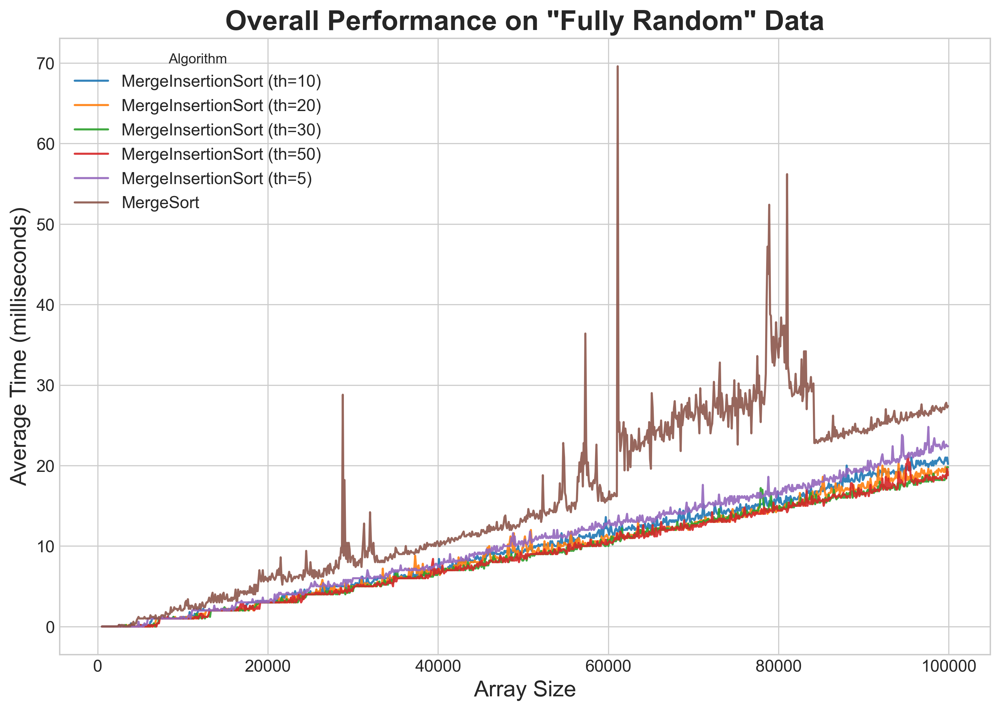
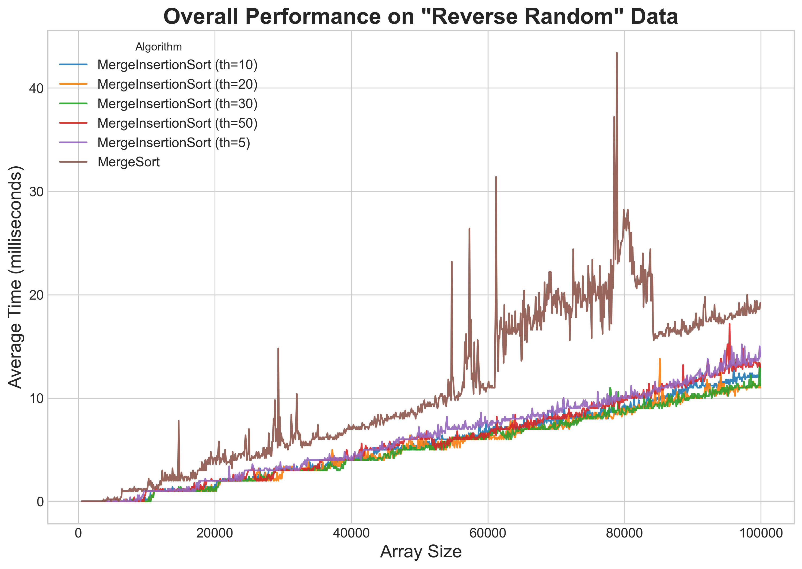
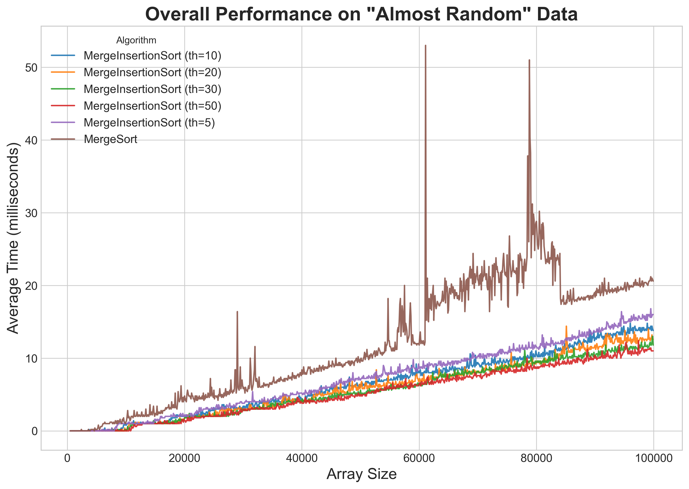
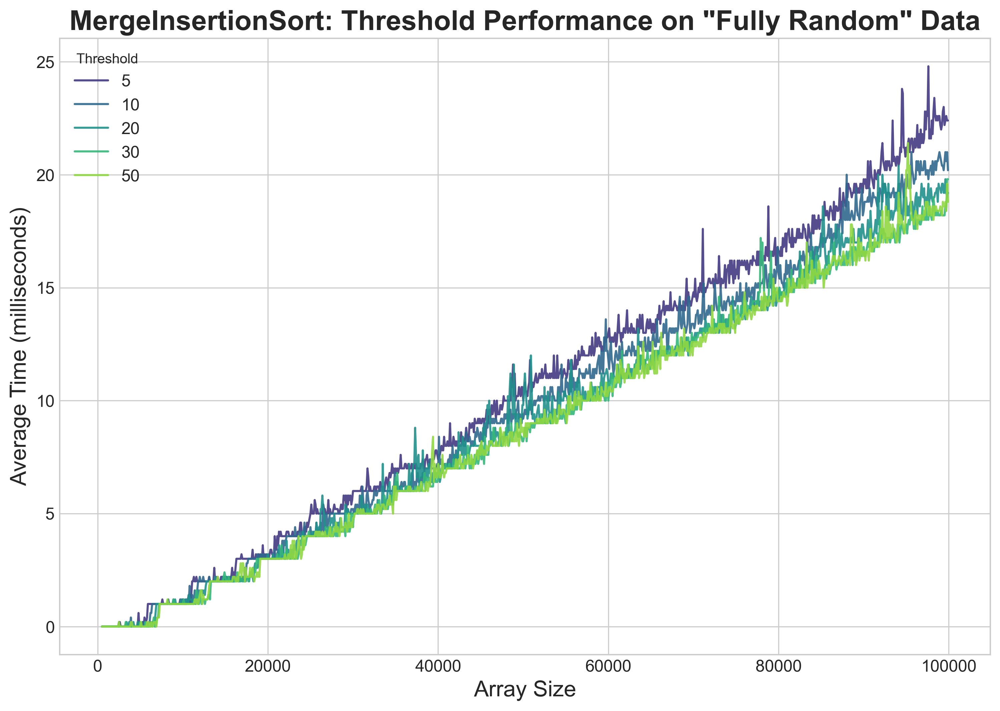
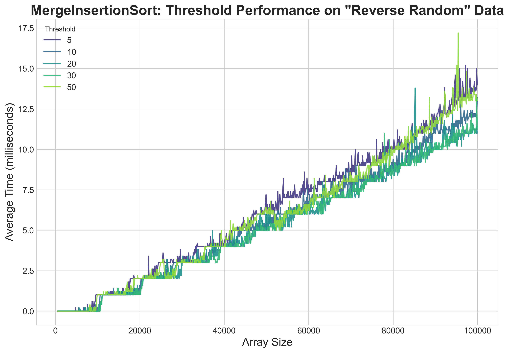
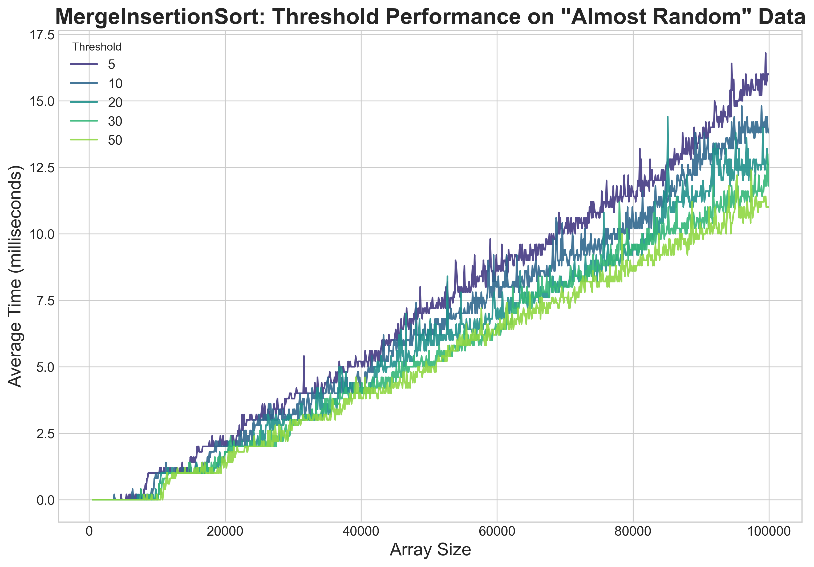
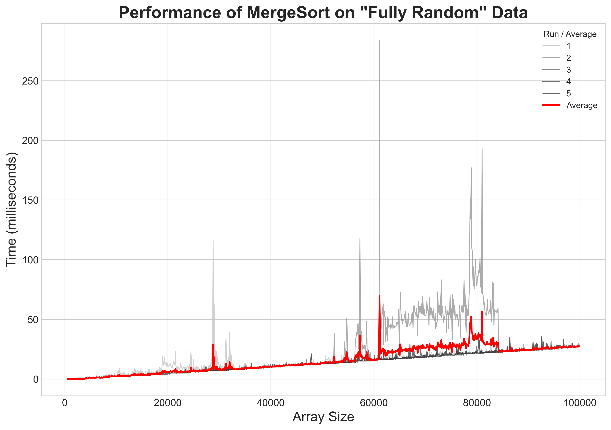

номер посылки на Codeforces: 347785713

# Анализ производительности MergeSort и гибридного Merge-Insertion Sort

## 1. Введение

Классический алгоритм сортировки слиянием (`MergeSort`) имеет гарантированную временную сложность O(N log N), но несет дополнительные издержки на рекурсивные вызовы для очень маленьких подмассивов. Гибридный подход (`MergeInsertionSort`) стремится оптимизировать этот процесс, переключаясь на более простую сортировку вставками (`InsertionSort`) для подмассивов, размер которых меньше определенного порога (`threshold`).

## 2. Методология эксперимента

### Алгоритмы
- **`MergeSort`**: Классическая рекурсивная реализация.
- **`MergeInsertionSort`**: Гибридная реализация с порогами переключения (`threshold`), равными **{5, 10, 20, 30, 50}**.

### Тестовые данные
Алгоритмы тестировались на трех типах целочисленных массивов:
- **`Fully Random`**: Элементы в случайном порядке.
- **`Reverse Random`**: Элементы отсортированы в порядке убывания.
- **`Almost Random`**: Почти отсортированный массив.

**Параметры:**
- **Размер массивов:** от 500 до 100,000 с шагом 100.
- **Расположение данных:** Исходные `.txt` файлы находятся в папке `data`.
- **Количество запусков:** 5 независимых запусков для каждого набора параметров для усреднения результатов.

### Инструменты
- **Бенчмаркинг**: 'A2i_benchmark.cpp'.
- **Анализ и визуализация**: 'A2_analysis.ipynb'.

---

## 3. Результаты и анализ

### 3.1. Общее сравнение производительности всех алгоритмов

На данных графиках представлены усредненные результаты работы всех протестированных алгоритмов (`MergeSort` и 5 вариаций `MergeInsertionSort`) для каждого типа массива.

#### На полностью случайных данных (`Fully Random`)

**Анализ:** На случайных данных все гибридные версии показывают небольшое, но стабильное преимущество над классическим `MergeSort`. Разница между разными порогами незначительна.

#### На обратно отсортированных данных (`Reverse Random`)

**Анализ:** В наихудшем сценарии (обратно отсортированный массив) картина практически идентична случайным данным. Гибридные подходы снова немного выигрывают у классического `MergeSort`.

#### На почти отсортированных данных (`Almost Random`)

**Анализ:** На почти отсортированных данных преимущество гибридного подхода становится очевидным. Сортировка вставками крайне эффективна на таких данных. График четко показывает, что **гибридные версии значительно опережают `MergeSort`**, причем версии с более высоким порогом (`th=50`) показывают наилучший результат.

### 3.2. Влияние порога на производительность MergeInsertionSort

Эта серия графиков показывает, как выбор порога (`threshold`) влияет на  скорость `MergeInsertionSort`.

#### На случайных и обратно отсортированных данных

**Анализ:** Для случайных (и аналогично для обратно отсортированных) данных все кривые лежат очень близко друг к другу. Оптимальным можно считать порог в диапазоне **20-30**, но выигрыш по сравнению с другими значениями минимален.

#### На почти отсортированных данных

**Анализ:** Здесь зависимость от порога выражена наиболее ярко. С увеличением порога производительность улучшается. Порог `50` является явным лидером. Это объясняется тем, что `InsertionSort` быстро обрабатывает большие, но уже почти упорядоченные подмассивы.

### 3.3. Анализ стабильности индивидуальных запусков

Для каждого из 18 тестовых случаев (6 алгоритмов * 3 типа данных) были построены детальные графики, показывающие результаты каждого из 5 запусков (серые линии) и их среднее значение (красная линия). Эти графики сохраняются в папку `runs_and_average_plots` и позволяют оценить разброс и стабильность измерений.

**Анализ:** Как видно из примера, индивидуальные запуски (серые линии) плотно сгруппированы вокруг средней линии (красная). Это говорит о стабильности и повторяемости измерений.

---

## 4. Заключение

**Гибридный `MergeInsertionSort` является эффективной оптимизацией** классического `MergeSort`. Он показывает либо такую же, либо лучшую производительность во всех рассмотренных