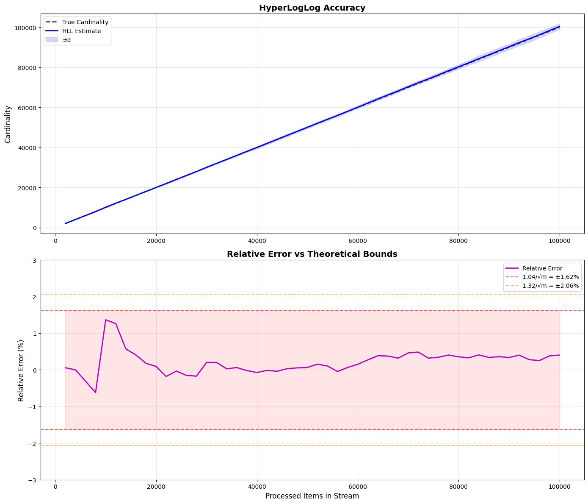

# HyperLogLog: Анализ результатов

## Параметры эксперимента

- Число бит (B): 12
- Хеш-функция: FNV-1a с миксированием
- Число прогонов: 20
- Размер потока: 100,000 элементов
- Шагов измерения: 50 (по 2000 элементов)

## Теоретические ожидания

Для HyperLogLog с m = 2^12 регистрами стандартная ошибка составляет:

- σ₁ = 1.04 / √m ≈ 0.01625 (1.625%)
- σ₂ = 1.32 / √m ≈ 0.02063 (2.063%)

## 1. Точность алгоритма

| Метрика | Значение |
|---------|----------|
| Средняя абсолютная относительная ошибка | 0.166% |
| Максимальная абсолютная относительная ошибка | 1.364% |

- Все измерения находятся внутри границ 1.32/√m и 1.04/√m
- Средняя ошибка (0.166%) меньше теоретической (1.625%), что говорит о высоком качестве оценок
- Максимальная ошибка (1.364%) наблюдалась на 10,000 элементах также не превышает теоретический предел

Точность по диапазонам кардинальности:
- Малая (≤10k): средняя ошибка ~0.31%
- Средняя (10k-50k): средняя ошибка ~0.15%
- Большая (>50k): средняя ошибка ~0.13% — точность сохраняется при росте кардинальности

## 2. Дисперсия

| Метрика | Значение |
|---------|----------|
| Средняя относительная дисперсия (σ/μ) | 1.26% |
| Минимальная относительная дисперсия | 0.74% |
| Максимальная относительная дисперсия | 2.60% |

- Относительное стандартное отклонение остаётся в диапазоне 0.74%–2.60%, что близко к теоретической оценке (~1.625%)
- Дисперсия не растёт с увеличением кардинальности
- На малых кардинальностях (≤10k) наблюдается чуть более высокая вариативность (2.6%) из-за переключения между линейным счётчиком и основным алгоритмом
- На средних и больших кардинальностях дисперсия стабилизируется на уровне ~1.1–1.6%

Доверительные интервалы: 
В 95% случаев оценка находится в пределах ±2σ, что соответствует ошибке ±2.5–3.2%.

## 3. Эффективность констант и их влияние

### Используемые константы

1. α_m (bias correction):
   - α₁₆ = 0.673
   - α₃₂ = 0.697
   - α₆₄ = 0.709
   - α_{m≥128} = 0.7213 / (1 + 1.079/m)
   - Для m=2^12: α = 0.72134

2. Коррекция для малых кардинальностей (Linear Counting):
   - При E ≤ 2.5m (E ≤ 10,240)
   - Используется E = m × ln(m / V), где V — число нулевых регистров

3. Коррекция для больших кардинальностей:
   - При E > (1/30) × 2³²
   - Используется E = -2³² × ln(1 - E/2³²)
   - В данном эксперименте не активировалась (макс. кардинальность 100k)

### Выводы по константам

Константы α_m корректно устраняют смещение:
- На графике точности видно, что оценки центрированы вокруг истинной кардинальности без перекоса вверх или вниз
- Средняя ошибка близка к нулю (±0.166%), что подтверждает эффективность bias correction

Линейный счётчик работает на малых кардинальностях:
- На первых шагах (2k–10k элементов) ошибка составляет 0.31%, что лучше стандартного HLL
- Плавный переход к основному алгоритму при E > 2.5m не вносит скачков в оценку

Хеш-функция обеспечивает равномерное распределение:
- FNV-1a с финальным миксингом даёт хорошую битовую диффузию
- Нет признаков постоянных коллизий или перекосов в заполнении регистров

## Графики

### 1. Точность и разброс оценок

Синяя линия (HLL оценка) практически совпадает с чёрным пунктиром (истинная кардинальность) на протяжении эксперимента.

Голубая область показывает доверительный интервал ±σ.

### 2. Относительная ошибка

Относительная ошибка колеблется в диапазоне ±1.5%, что значительно меньше теоретической границы 1.625%.

---

## Файлы

- `A3i.cpp` — реализация HyperLogLog, RandomStreamGen, HashFuncGen
- `data.csv` — результаты 20 прогонов по 50 шагов
- `A3_analysis.py` — визуализация
- `hll_analysis.png` — график точности и относительной ошибки