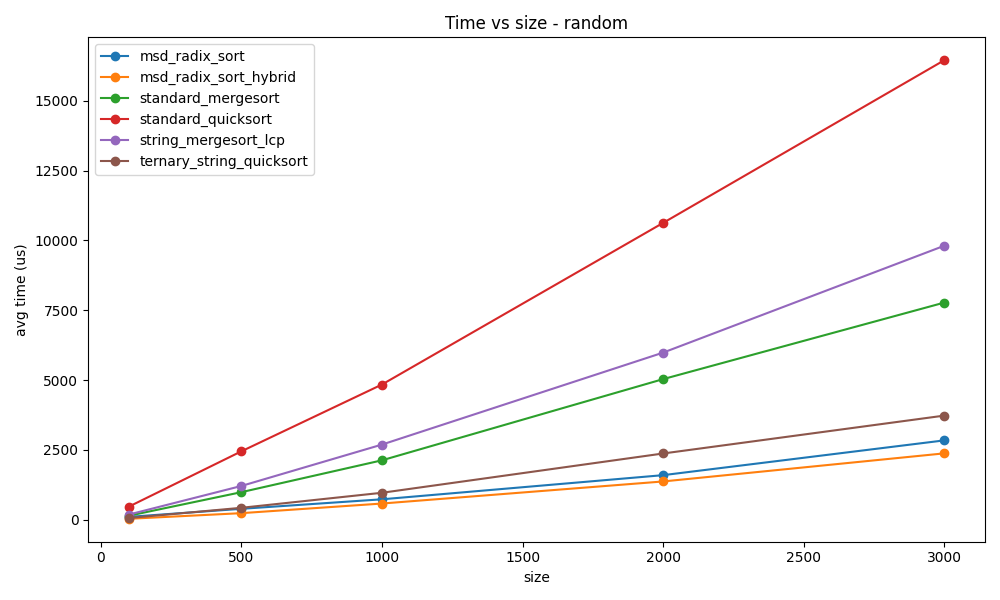
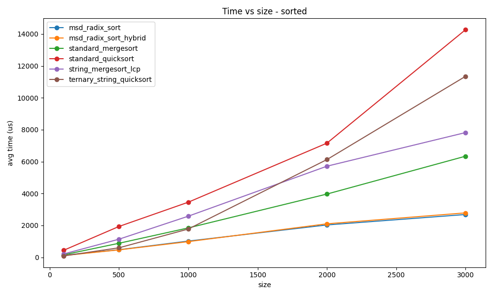
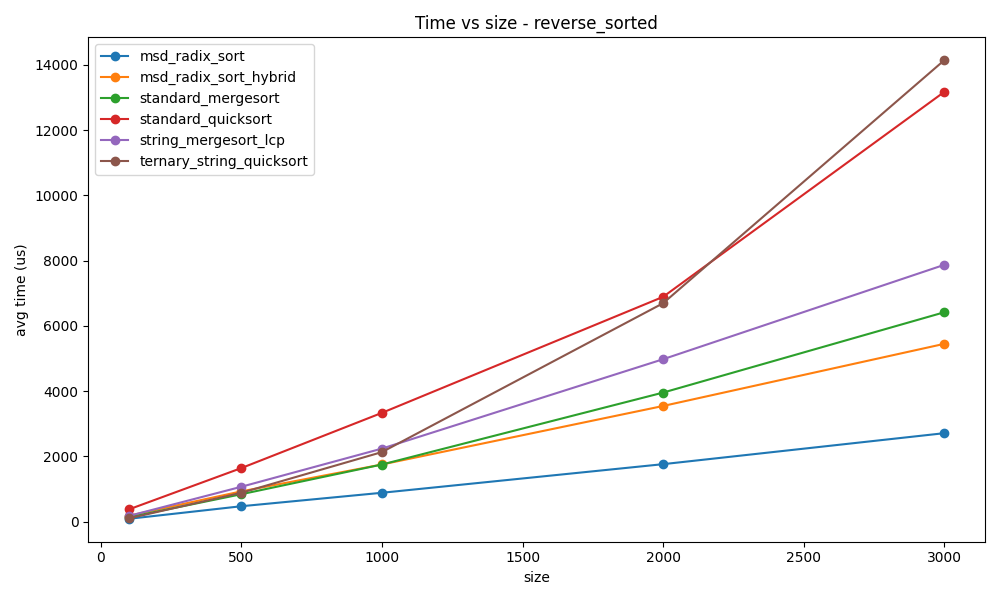
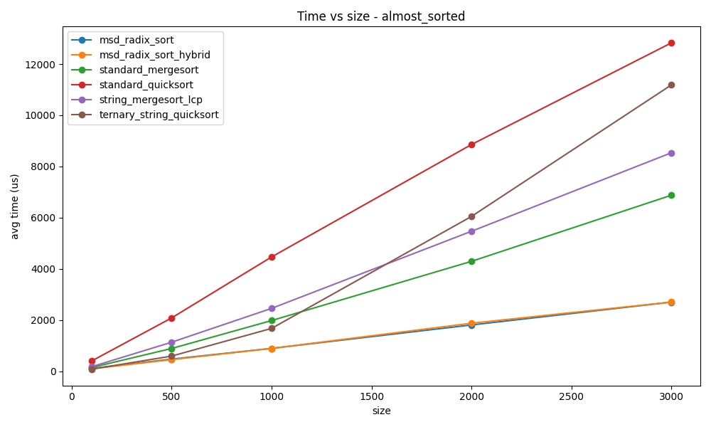
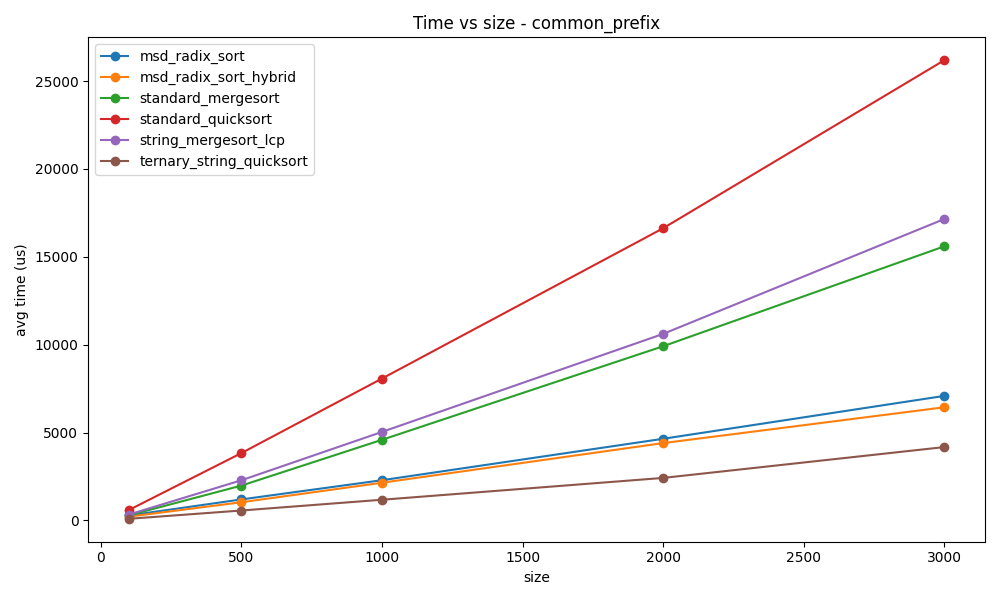
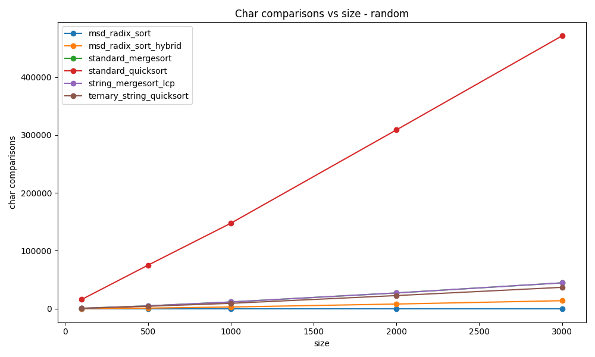
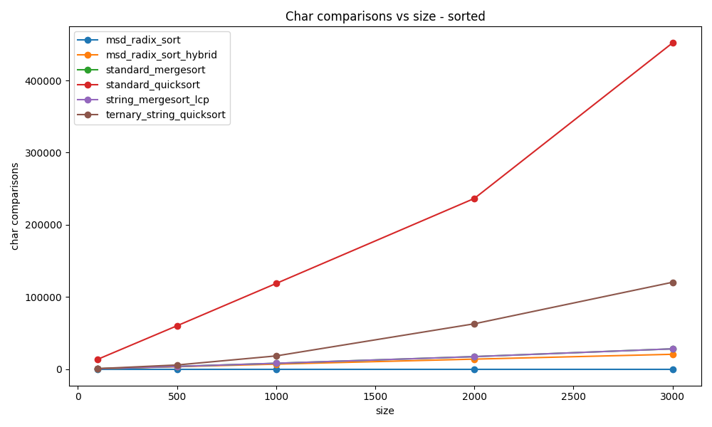
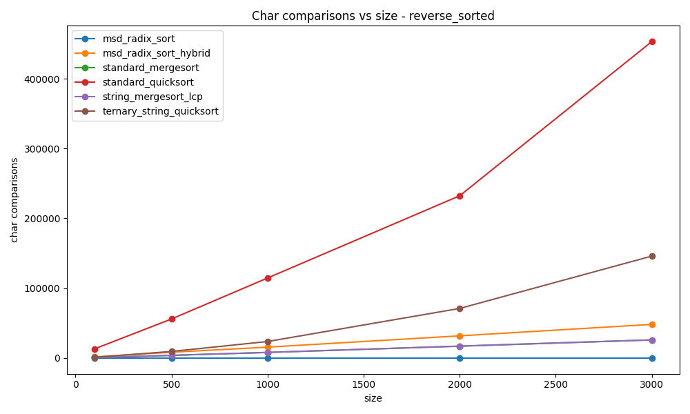
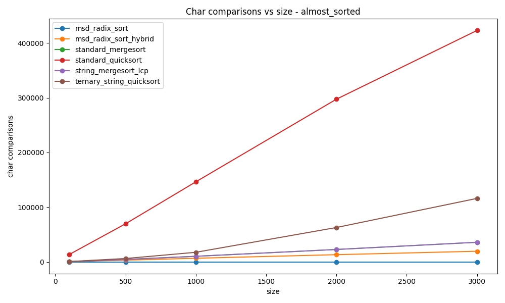
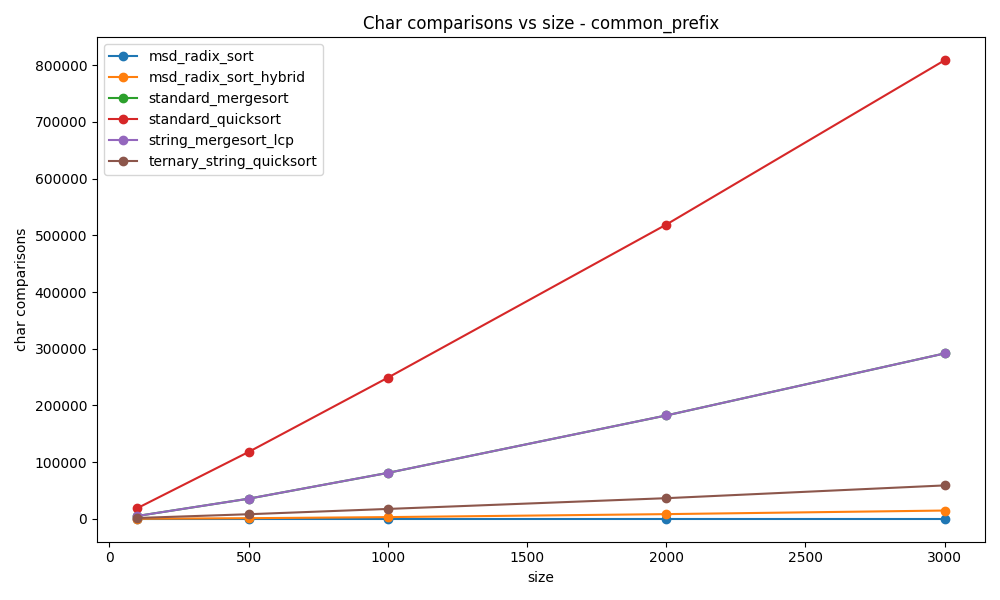

# String Sorting: Анализ результатов

## Параметры эксперимента

Сравнивались следующие алгоритмы сортировки строк:

* `standard_quicksort`
* `standard_mergesort`
* `ternary_string_quicksort`
* `string_mergesort_lcp`
* `msd_radix_sort`
* `msd_radix_sort_hybrid`

Тестирование проводилось на пяти типах данных:

* `random`
* `sorted`
* `reverse_sorted`
* `almost_sorted`
* `common_prefix`

Размеры массивов строк:

* 100
* 500
* 1000
* 2000
* 3000

Для каждого прогона измерялись:

* среднее время сортировки (`avg_time_us`)
* число символьных сравнений (`char_comparisons`)

Каждое измерение усреднялось по 5 запускам.

---

## Теоретические ожидания

Для строк классические сравнения по символам должны становиться очень дорогими, если строки имеют общий префикс или если сортировка вызывает большое число сравнений.

Из этого следуют ожидаемые закономерности:

* `standard_quicksort` должен быть одним из самых медленных вариантов, так как он многократно сравнивает строки посимвольно с начала.
* `standard_mergesort` должен быть стабильнее по времени, чем quicksort, но всё равно зависеть от стоимости строковых сравнений.
* `ternary_string_quicksort` должен хорошо работать на строках, потому что сравнение идёт по символам с учётом текущей глубины.
* `string_mergesort_lcp` в идеале должен выигрывать у обычного mergesort за счёт LCP-оптимизации, но это зависит от того, как именно реализовано переиспользование длины общего префикса.
* `msd_radix_sort` и `msd_radix_sort_hybrid` должны показывать наилучшие или близкие к лучшим результаты по времени, так как они уменьшают число полных строковых сравнений.

---

## 1. Общая картина по времени

Если усреднить все результаты по всем наборам данных и размерам, получается следующее:

| Алгоритм                   | Среднее время, мкс |
| -------------------------- | -----------------: |
| `msd_radix_sort`           |               1574 |
| `msd_radix_sort_hybrid`    |               1725 |
| `ternary_string_quicksort` |               3176 |
| `standard_mergesort`       |               3554 |
| `string_mergesort_lcp`     |               4273 |
| `standard_quicksort`       |               6856 |

Из таблицы видно, что:

* **лучшие результаты по времени** показывают `msd_radix_sort` и `msd_radix_sort_hybrid`;
* **обычный quicksort** оказывается самым медленным;
* `ternary_string_quicksort` заметно быстрее классического quicksort и часто сопоставим с mergesort;
* `string_mergesort_lcp` в данной реализации не даёт ожидаемого выигрыша относительно обычного mergesort.

---

## 2. Анализ по типам входных данных

### 2.1. Случайные строки (`random`)

На случайных строках выигрывают алгоритмы MSD radix.

| Алгоритм                   | Время на размере 3000, мкс |
| -------------------------- | -------------------------: |
| `msd_radix_sort_hybrid`    |                       2377 |
| `msd_radix_sort`           |                       2841 |
| `ternary_string_quicksort` |                       3728 |
| `standard_mergesort`       |                       7772 |
| `string_mergesort_lcp`     |                       9806 |
| `standard_quicksort`       |                      16445 |

`standard_quicksort` проигрывает, так как выполняет большое количество полных строковых сравнений.
Гибридный MSD radix здесь даёт лучший результат.

---

### 2.2. Уже отсортированные строки (`sorted`)

| Алгоритм                   | Время на размере 3000, мкс |
| -------------------------- | -------------------------: |
| `msd_radix_sort`           |                       2682 |
| `msd_radix_sort_hybrid`    |                       2783 |
| `standard_mergesort`       |                       6337 |
| `string_mergesort_lcp`     |                       7818 |
| `ternary_string_quicksort` |                      11344 |
| `standard_quicksort`       |                      14267 |

Здесь `msd_radix_sort` остаётся лучшим, а `standard_quicksort` всё ещё показывает худший результат.

---

### 2.3. Обратный порядок (`reverse_sorted`)

| Алгоритм                   | Время на размере 3000, мкс |
| -------------------------- | -------------------------: |
| `msd_radix_sort`           |                       2708 |
| `msd_radix_sort_hybrid`    |                       5446 |
| `standard_mergesort`       |                       6414 |
| `string_mergesort_lcp`     |                       7868 |
| `standard_quicksort`       |                      13169 |
| `ternary_string_quicksort` |                      14140 |

В этом наборе данных `msd_radix_sort` снова лидирует.
Гибридный вариант хуже базового radix.
`ternary_string_quicksort` здесь уже не даёт преимущества и оказывается одним из самых медленных вариантов.

---

### 2.4. Почти отсортированные строки (`almost_sorted`)

| Алгоритм                   | Время на размере 3000, мкс |
| -------------------------- | -------------------------: |
| `msd_radix_sort`           |                       2700 |
| `msd_radix_sort_hybrid`    |                       2701 |
| `standard_mergesort`       |                       6874 |
| `string_mergesort_lcp`     |                       8533 |
| `ternary_string_quicksort` |                      11184 |
| `standard_quicksort`       |                      12827 |

Здесь `msd_radix_sort` и `msd_radix_sort_hybrid` практически одинаковы по времени.

---

### 2.5. Строки с общим префиксом (`common_prefix`)

| Алгоритм                   | Время на размере 3000, мкс |
| -------------------------- | -------------------------: |
| `ternary_string_quicksort` |                       4173 |
| `msd_radix_sort_hybrid`    |                       6438 |
| `msd_radix_sort`           |                       7085 |
| `standard_mergesort`       |                      15594 |
| `string_mergesort_lcp`     |                      17148 |
| `standard_quicksort`       |                      26182 |

Здесь лучшим оказывается `ternary_string_quicksort`.

---

## 3. Анализ числа символьных сравнений

Число символьных сравнений хорошо показывает, насколько алгоритм зависит от посимвольного сопоставления строк.

Среднее число сравнений по всем экспериментам:

| Алгоритм                   | Среднее число символьных сравнений |
| -------------------------- | ---------------------------------: |
| `msd_radix_sort`           |                                  0 |
| `msd_radix_sort_hybrid`    |                               9897 |
| `ternary_string_quicksort` |                              34359 |
| `standard_mergesort`       |                              34897 |
| `string_mergesort_lcp`     |                              34897 |
| `standard_quicksort`       |                             217307 |

* `standard_quicksort` выполняет **на порядок больше** символьных сравнений, чем остальные алгоритмы.
* `standard_mergesort` и `string_mergesort_lcp` имеют **одинаковое** число сравнений во всех сериях.
* `msd_radix_sort` не использует классические строковые сравнения в той части, которую мы считаем этим счётчиком, поэтому значение получается нулевым.
* `ternary_string_quicksort` уменьшает число сравнений по сравнению с обычными алгоритмами, но на данных с общим префиксом всё равно может уступать radix по времени.

---

## 4. Итоговые выводы

1. **Самыми эффективными по времени в целом являются MSD radix-алгоритмы.**
   Особенно хорошо они работают на случайных, отсортированных и почти отсортированных данных.

2. **Обычный quicksort на строках является наименее удачным выбором.**
   Он проигрывает из-за большого числа дорогих посимвольных сравнений.

3. **Ternary string quicksort особенно полезен на данных с длинным общим префиксом.**
   На наборе `common_prefix` он показал лучший результат среди всех алгоритмов.

4. **Обычный mergesort стабильнее quicksort, но всё равно уступает radix-методам.**

5. **Выбор алгоритма сильно зависит от структуры строкового входа.**
   Для общего случая наиболее универсальным и быстрым выглядит `msd_radix_sort`, а для массивов с общим префиксом — `ternary_string_quicksort`.

---
